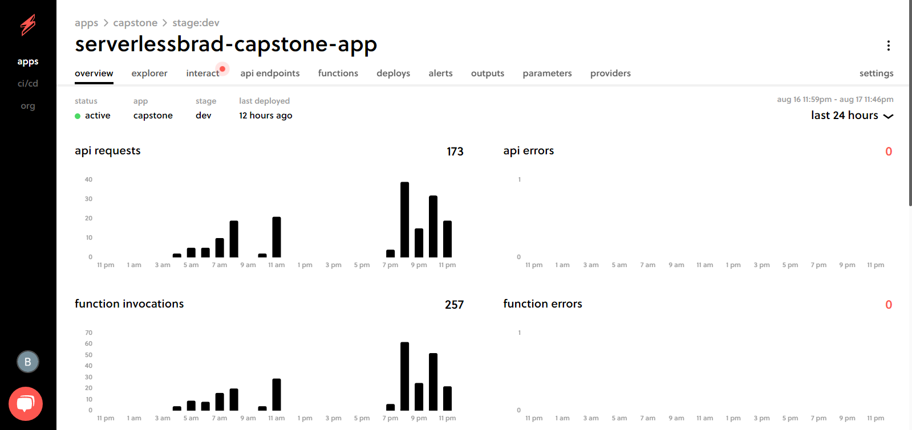
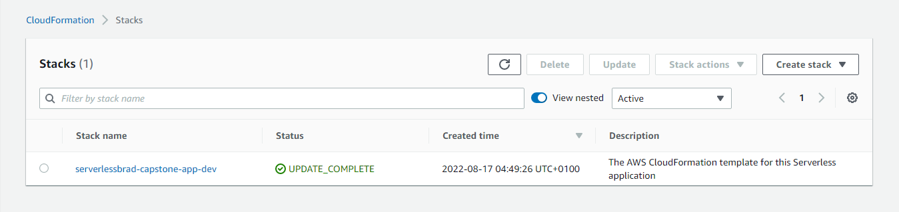
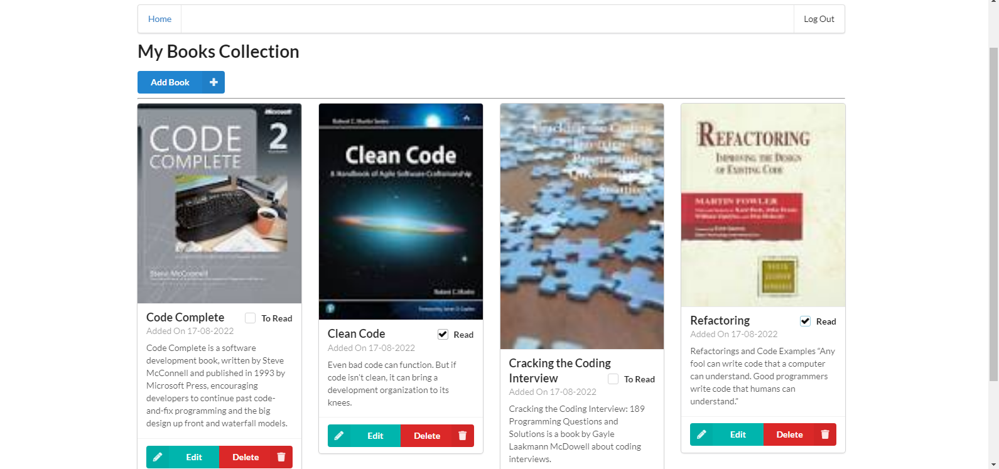
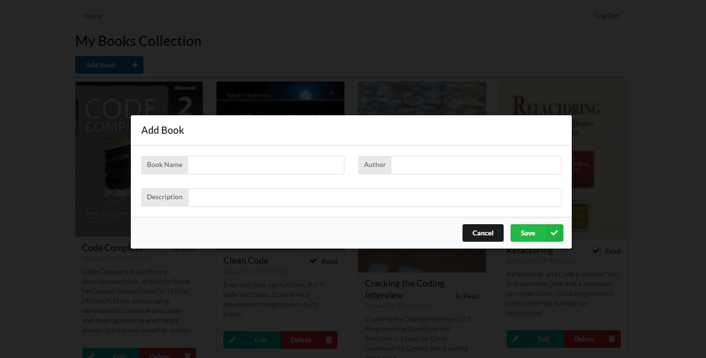

# My Books Collection

A simple book store that allows a logged in user to add and manipulate books in their collection.

# Functionality of the application

This application will allow creating/removing/updating/fetching BOOK items. Each BOOK item can optionally have an attachment image. Each user only has access to BOOK items that he/she has created.

# BOOK items

The application stores BOOK items containing the following fields:

* `bookId` (string) - a unique id for an item
* `addedOn` (string) - date and time when an item was added to collection
* `bookName` (string) - name of a BOOK item (e.g. "Java Programming Essentials")
* `author` (string) - Author of the BOOK
* `description` (string) - Description of the BOOK
* `read` (boolean) - true if an book has been read, false otherwise
* `attachmentUrl` (string) (optional) - a URL pointing to an image attached to a TODO item

The id of the user who added a BOOK item is also stored.

## Prerequisites

* <a href="https://manage.auth0.com/" target="_blank">Auth0 account</a>
* <a href="https://github.com" target="_blank">GitHub account</a>
* <a href="https://nodejs.org/en/download/package-manager/" target="_blank">NodeJS</a> version up to 12.xx 
* Serverless 
   * Create a <a href="https://dashboard.serverless.com/" target="_blank">Serverless account</a> user
   * Install the Serverless Framework’s CLI  (up to VERSION=2.21.1). Refer to the <a href="https://www.serverless.com/framework/docs/getting-started/" target="_blank">official documentation</a> for more help.
   ```bash
   npm install -g serverless@2.21.1
   serverless --version
   ```
   * Login and configure serverless to use the AWS credentials 
   ```bash
   # Login to your dashboard from the CLI. It will ask to open your browser and finish the process.
   serverless login
   # Configure serverless to use the AWS credentials to deploy the application
   # You need to have a pair of Access key (YOUR_ACCESS_KEY_ID and YOUR_SECRET_KEY) of an IAM user with Admin access permissions
   sls config credentials --provider aws --key YOUR_ACCESS_KEY_ID --secret YOUR_SECRET_KEY --profile serverless
   ```


# Frontend

The `client` folder contains a web application that can use the API developed in the project.

`config.ts` file in the `client` folder contains the configurations for the API endpoint and Auth0 configuration:

```ts
const apiId = '5z4ua1scrc' API Gateway id
export const apiEndpoint = `https://${apiId}.execute-api.us-east-1.amazonaws.com/dev`

export const authConfig = {
  domain: 'dev-etfd3hhv.us.auth0.com',    // Domain from Auth0
  clientId: 'JLL0LYJZ2KxzHFlFdx3sAGJXzk5gVgRE',  // Client id from an Auth0 application
  callbackUrl: 'http://localhost:3000/callback'
}
```


# How to run the application

## Backend

To deploy an application run the following commands:

```
cd backend
npm install
sls deploy -v
```

## Frontend

To run a client application first edit the `client/src/config.ts` file to set correct parameters. And then run the following commands:

```
cd client
npm install
npm run start
```

This should start a development server with the React application that will interact with the serverless TODO application.

# Runing Apllication

## Serverless Dashboard App Overview



## Cloud Formation Stack



## Client Application



